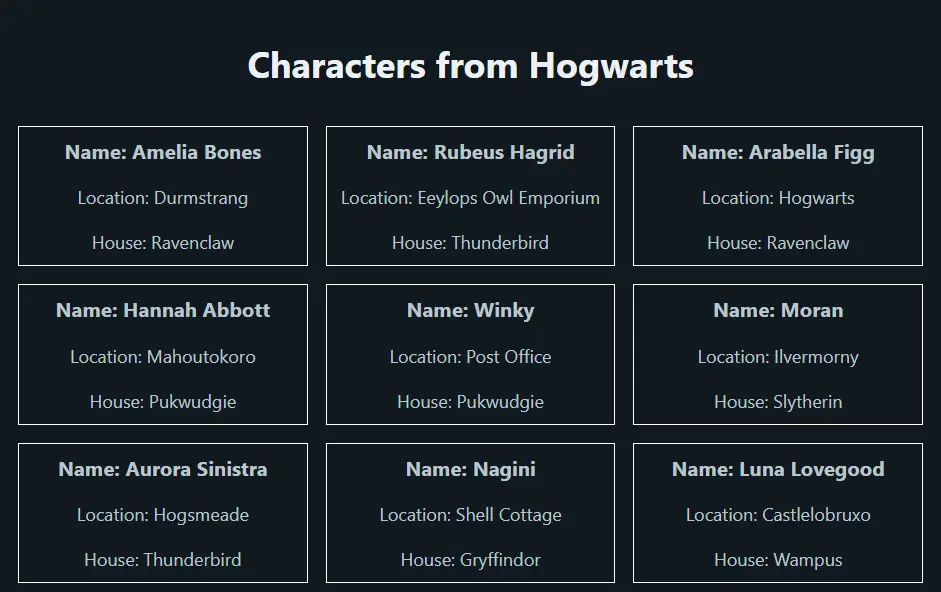

# Desafío evaluado "Despliegue de una aplicación en internet utilizando Heroku"

Aplicación web hecha con Ruby on Rails diseñada para almacenar y mostrar el nombre, ubicación y casa de distintos personajes de Harry Potter.

# Software utilizado

Ruby 3.2.2  
Rails 7.0.5  
PostgreSQL 14.8  
Pico CSS  

# Deployment en Heroku vía CLI

* Iniciar sesión con ```heroku login```
* Crear aplicación con ```heroku create```
* Conectar con la aplicación con ```heroku git:remote -a nombre_aplicación```
* Subir aplicación con ```git push heroku main```
* Ejecutar migración con ```heroku run rails db:migrate```
* Ejecutar seed de datos con ```heroku run rails db:seed```

# Vista de aplicación


